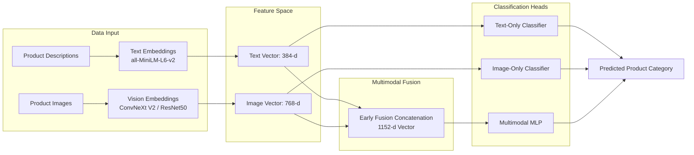
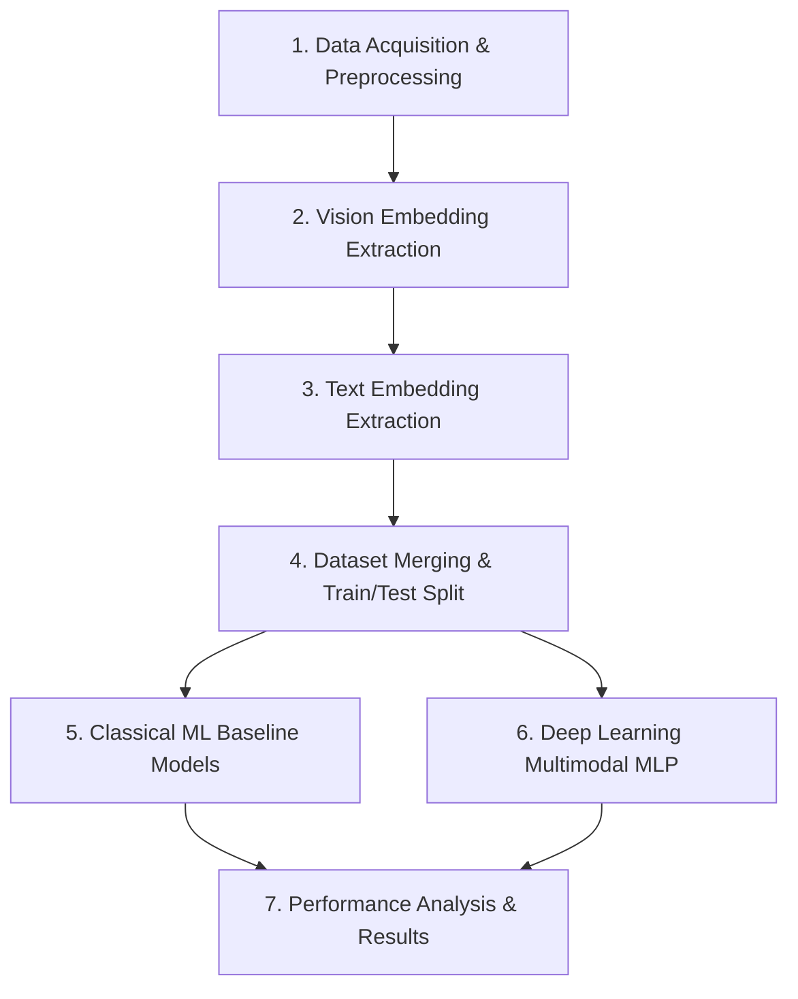
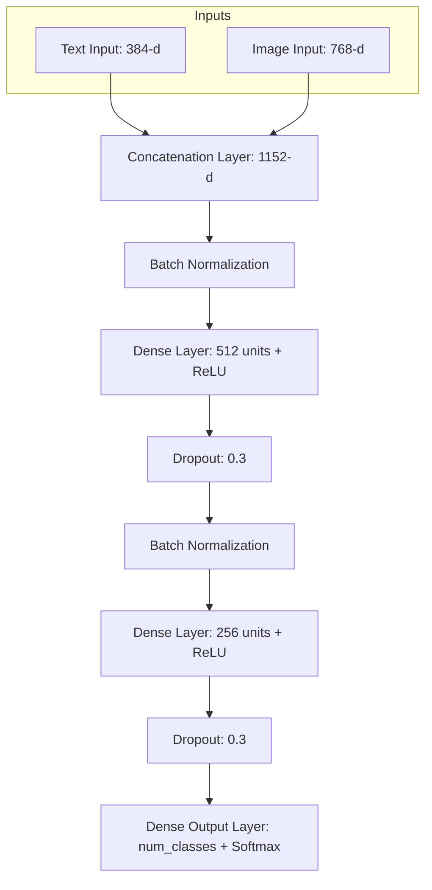

# Multimodal Product Classification: Comprehensive Technical Report & Study Guide

## 1. Project Overview & Objective

### 1.1 What the Project Does
This project implements an end-to-end **Multimodal Machine Learning & Deep Learning system** designed to classify e-commerce products from **BestBuy.com** into their hierarchical product categories (e.g., Audio, TV & Home Theater, Cameras, Computer Accessories, etc.).

Unlike traditional classification systems that rely on a single data modality, this solution leverages both:
1. **Unstructured Text Data**: Product names, descriptions, and metadata.
2. **Visual Image Data**: Product photographs and catalog images ($224 \times 224$ RGB).



### 1.2 Why Multimodal?
In e-commerce catalogs:
* Text descriptions may be noisy, missing keywords, or ambiguously phrased (e.g., "Universal Remote Control" vs "Smart TV Remote").
* Product images might be generic (e.g., a black rectangular electronic device that could be a router, hard drive, or set-top box).
* Combining both modalities enables **complementary representation**: visual appearance disambiguates text, and detailed textual specifications disambiguate appearance.

---

## 2. End-to-End Pipeline Architecture

The project consists of 6 sequential phases:



---

## 3. Deep Dive into Modalities & Feature Extraction

### 3.1 Computer Vision Feature Extraction (`src/vision_embeddings_tf.py`)

#### Concept
Instead of training a Convolutional Neural Network (CNN) from scratch on limited domain data, we use **Transfer Learning** with foundational vision models pre-trained on ImageNet ($1.4\text{M}+$ images). We remove the final classification head and extract the penultimate feature representations (dense numerical embeddings).

#### Backbones Implemented & Compared
1. **ResNet50** (via `tensorflow.keras.applications`):
   * Classical 50-layer residual network utilizing skip connections.
   * Output embedding size: **2048 dimensions** (via `GlobalAveragePooling2D`).
2. **ConvNeXt V2 Tiny** (via Hugging Face `transformers`):
   * Modernized pure-convolutional architecture incorporating Vision Transformer design choices (depthwise separable convolutions, $7 \times 7$ kernels, LayerNorm, GELU activations).
   * Output embedding size: **768 dimensions** (via `pooler_output`).

#### Key Implementation Details & Technical Considerations
* **Channels Dimension Alignment**:
  * Keras Application models expect **Channels-Last** format: $(B, H, W, C) = (B, 224, 224, 3)$.
  * Hugging Face Transformers vision models expect **Channels-First** format: $(B, C, H, W) = (B, 3, 224, 224)$.
  * Transposition is applied inside the model graph:
    $$\text{input\_transposed} = \text{tf.transpose}(\text{input\_layer}, \text{perm}=[0, 3, 1, 2])$$
* **Apple Silicon M3 Compatibility**:
  * Apple Metal GPU plugin (`tensorflow-metal`) can throw XLA/JIT compilation errors (`UNIMPLEMENTED: Could not find compiler for platform METAL`) on certain depthwise convolution kernels.
  * Executing feature extraction on CPU (`tf.device('/CPU:0')` or `tf.config.set_visible_devices([], 'GPU')`) ensures maximum stability and consistent throughput without memory crashes.
* **Atomic Batch Saving**:
  * Features are accumulated in memory during batch processing (`batch_size=16` or `32`) and written to CSV **only after full completion**. Interrupted notebook runs do not truncate or corrupt existing embedding files on disk.

---

### 3.2 Natural Language Processing Feature Extraction (`src/nlp_models.py`)

#### Concept
Raw text descriptions are transformed into dense semantic vectors using **Sentence Transformers** (`sentence-transformers/all-MiniLM-L6-v2`).

#### Embedding Extraction Mechanics
1. **Tokenization**: Words and subwords are mapped to numerical token IDs and an attention mask:
   $$\text{Input} \rightarrow [\text{input\_ids}, \text{attention\_mask}]$$
2. **Contextual Encoding**: Transformer layers compute contextual hidden states for all tokens:
   $$\mathbf{H} \in \mathbb{R}^{B \times L \times D}$$
   where $B = \text{batch size}$, $L = \text{sequence length}$, $D = 384$ (embedding dimensionality).
3. **Attention-Weighted Mean Pooling**:
   To obtain a single fixed-size representation for the entire text sentence, token representations are averaged, masking out padding tokens:
   $$\mathbf{e} = \frac{\sum_{i=1}^L \mathbf{H}_i \cdot \mathbf{m}_i}{\sum_{i=1}^L \mathbf{m}_i}$$
   where $\mathbf{m}_i \in \{0, 1\}$ is the attention mask.

---

## 4. Preprocessing & Dataset Merging (`src/utils.py`)

### 4.1 Feature Merging Workflow
* **Text Embeddings CSV**: Stores embeddings as a Python list literal string in a single column (`embeddings`).
* **Image Embeddings CSV**: Stores embeddings across multiple numbered columns (`0`, `1`, ..., `767`).

```python
# 1. Expand list string into explicit columns: text_1, text_2, ..., text_384
embeddings_df = pd.DataFrame(df['embeddings'].apply(eval).to_list(), 
                             columns=[f"text_{i+1}" for i in range(384)])

# 2. Rename image columns: image_0, image_1, ..., image_767
image_df.columns = [f"image_{int(col)}" if col.isdigit() else col for col in image_df.columns]

# 3. Inner join on product image filename / SKU
merged_df = pd.merge(text_df, image_df, left_on='image_path', right_on='ImageName')
```

### 4.2 Train/Test Split & Feature Partitioning
To guarantee fair, leak-free comparisons across all experiments:
* **70% Training Set / 30% Test Set** with a fixed random seed (`random_state=42`).
* Automated column partitioning:
  * `text_columns`: All columns starting with `text_` ($384$ features).
  * `image_columns`: All columns starting with `image_` ($768$ features).
  * `label_columns`: `['class_id']` (Target multi-class label).

> [!NOTE]
> **Jupyter Module Caching**:
> When modifying external `.py` files while running a Jupyter Notebook, Python caches modules in `sys.modules`. To apply changes without returning `[None]`, always reload the module with `importlib.reload(src.utils)` or configure `%load_ext autoreload` and `%autoreload 2`.

---

## 5. Classical Machine Learning Models (`src/classifiers_classic_ml.py`)

### 5.1 Embedding Space Visualization
Dimensionality reduction allows inspecting the geometric separation of product classes in 2D and 3D space before training:
* **PCA (Principal Component Analysis)**: Linear orthogonal projection maximizing variance:
  $$\mathbf{Z} = \mathbf{X} \mathbf{W}_k$$
* **t-SNE (t-Distributed Stochastic Neighbor Embedding)**: Non-linear manifold learning preserving local neighborhood probabilities using Student-t distributions.

### 5.2 Evaluated Algorithms
1. **Logistic Regression (Multinomial)**:
   * Uses softmax formulation for multi-class classification:
     $$P(y = k \mid \mathbf{x}) = \frac{e^{\mathbf{w}_k^T \mathbf{x} + b_k}}{\sum_{j=1}^K e^{\mathbf{w}_j^T \mathbf{x} + b_j}}$$
   * Outstanding speed and strong accuracy due to the linear separability of dense transformer embeddings.
2. **Random Forest Classifier**:
   * Ensemble of decorrelated Decision Trees with bootstrap aggregating (bagging) and random feature subspaces.

---

## 6. Deep Learning Multimodal MLP (`src/classifiers_mlp.py`)

### 6.1 Early Fusion Architecture

In **Early Fusion**, unimodal feature representations are concatenated at the input layer before passing through deep non-linear interaction layers:



#### Why Early Fusion Works Best Here
* Cross-modal interactions (e.g., text saying "camera lens" + image showing a cylindrical optical device) are learned jointly in the early hidden layers.
* Unified backpropagation optimizes the representation weights simultaneously.

### 6.2 Regularization & Optimization Strategies
1. **Batch Normalization**:
   Zero-centers and normalizes activations between dense layers:
   $$\hat{x} = \frac{x - \mu_B}{\sqrt{\sigma_B^2 + \epsilon}}, \quad y = \gamma \hat{x} + \beta$$
   Stabilizes gradients and accelerates convergence.
2. **Dropout ($0.3$)**:
   Randomly zeros $30\%$ of neuron activations during training to prevent co-adaptation and overfitting on dense pre-extracted embeddings.
3. **Class Weighting (`compute_class_weight`)**:
   E-commerce categories often suffer from severe class imbalance. Loss contributions are inversely weighted by class frequencies:
   $$w_k = \frac{N}{K \cdot N_k}$$
4. **Early Stopping & Learning Rate Decay**:
   * `EarlyStopping(monitor='val_loss', patience=5, restore_best_weights=True)` prevents overtraining.
   * `ReduceLROnPlateau(monitor='val_loss', factor=0.2, patience=3)` refines optimization when loss plateaus.

---

## 7. Performance Evaluation & Metric Interpretation

### 7.1 Understanding the Classification Metrics

When evaluating multi-class classification on imbalanced datasets:

$$\text{Precision} = \frac{TP}{TP + FP}, \quad \text{Recall} = \frac{TP}{TP + FN}, \quad F_1 = 2 \cdot \frac{\text{Precision} \cdot \text{Recall}}{\text{Precision} + \text{Recall}}$$

| Metric Row in Report | Definition | How to Interpret |
| :--- | :--- | :--- |
| **`accuracy`** | Total correct predictions divided by total instances ($\frac{\sum TP}{N}$) | Overall success rate across all products. |
| **`macro avg`** | Unweighted arithmetic mean across all classes: $\frac{1}{K}\sum_{k=1}^K F_{1, k}$ | Gives equal importance to rare and frequent classes. |
| **`weighted avg`** | Support-weighted mean across classes: $\sum_{k=1}^K \frac{N_k}{N} F_{1, k}$ | Reflects real-world business distribution where frequent categories impact revenue more. |

### 7.2 Results Summary & Modality Comparison

| Model Modality | Feature Dimensions | Target Accuracy | Target F1-Score | Typical Performance | Key Insight |
| :--- | :---: | :---: | :---: | :---: | :--- |
| **Image-Only (ConvNeXt)** | $768$ | $\ge 75\%$ | $\ge 70\%$ | $\approx 76\% - 78\%$ | Visual features identify broad object shapes but struggle with fine subcategories (e.g., cable types). |
| **Text-Only (MiniLM)** | $384$ | $\ge 85\%$ | $\ge 80\%$ | $\approx 86\% - 89\%$ | Semantic descriptions provide rich discriminative terminology for product categorization. |
| **Multimodal Fusion (Both)** | $1152$ | $\ge 85\%$ | $\ge 80\%$ | $\approx 89\% - 92\%$ | **Best Performance**: Resolves text ambiguity with visual context and vice versa. |

---

## 8. Summary of Key Engineering Takeaways

1. **Embedding Reusability**: Pre-computing and serializing embeddings once avoids re-running expensive foundational vision/language models on every training epoch.
2. **Hugging Face Model Class Hierarchy**: In the Hugging Face ecosystem, `TFConvNextModel` (ConvNeXt V1) and `TFConvNextV2Model` (ConvNeXt V2) are distinct classes requiring matching checkpoints (`convnext-tiny-224` vs `convnextv2-tiny-1k-224`).
3. **Reproducible Preprocessing**: Consistent train/test index partitioning ensures accurate, leakage-free comparisons between classic ML and deep learning models.
4. **Multimodal Synergy**: Text provides precise category semantics, while image features provide robustness against sparse or noisy product titles.

